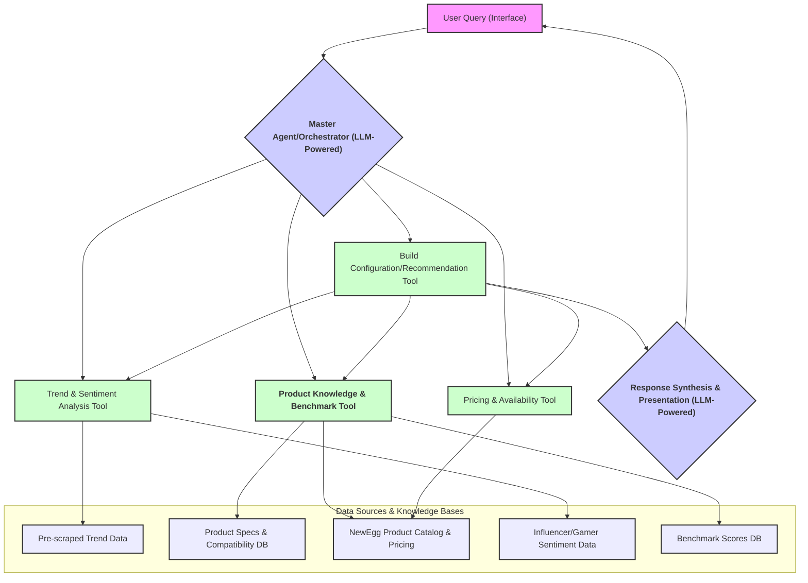

# 🐣 EggHatch: AI Agent for PC Building & Gear Shopping

> "Your next tech upgrade is about to hatch."

## Current NewEgg AI Application Gaps

Current AI tools on NewEgg, while helpful, present opportunities for enhancement:

- **AI Assistant**: Lack of maintaining conversational context causes responses to become irrelevant or contradictory. The basis for its recommendations is not clear, potentially limiting the personalization and depth of advice (e.g., recommendation engine vs. simple keyword matching).

- **"PC Building with AI" Tool**: Primarily relies on structured inputs or keyword recognition, lacking nuanced natural language understanding for complex user requests regarding PC builds.

- **Segmented User Experience**: NewEgg has implemented an AI chatbot and a "PC building with AI" tool, but these often operate as separate entities accessed from different entry points. This can lead to a disjointed experience, lacking a unique and consistent AI identity that could foster a stronger connection and more seamless journey for customers.

This EggHatch AI Agent aims to address these gaps by providing a more conversational, context-aware, and deeply analytical AI agent.

## Core Idea

A user interacts with the "EggHatch AI Agent" using natural language (e.g., "I want to build a gaming PC with a $2000 budget," or "What's the best gaming laptop under $1500?"). The agent then orchestrates several specialized sub-agents or tools to fulfill the request, providing comprehensive recommendations including performance benchmarks.

## High-Level Agent Architecture & Workflow



## Detailed Components & Workflow

### 1. Master Agent / Orchestrator

#### Input
- User's natural language query

#### Tasks
- Uses an LLM to understand user intent, budget, preferences, and needs
- Decomposes the query into sub-tasks for specialized agents/tools
- Manages information flow between sub-agents and maintains conversational state

#### Example
For "I need a gaming laptop around $1800 that's good for competitive FPS titles and has a decent Time Spy score," it identifies tasks like:
- Determine current popular gaming laptop models in this price range
- Check key features (refresh rate, GPU, CPU)
- Find reported Time Spy scores for these models
- Get current prices and availability
- Consider current trends and reviews

#### Tech Stack

##### POC Level
- **Orchestration**: Python with LangGraph
- **LLM Integration**: Python requests library or dedicated client for locally hosted LLM via Ollama API
- **State Management**: In-memory within LangGraph states or simple Python dictionaries
- **Prompt Engineering**: Manually crafted prompts stored as strings or in configuration files

##### Production Level
- **Orchestration**: LangGraph deployed as part of a scalable service (e.g., on Kubernetes)
- **Concurrency & Async**: Message queuing system (e.g., Kafka)
- **LLM Integration**: Robust API clients with retry logic and error handling
- **State Management**: Distributed cache (Redis) and NoSQL database (MongoDB)
- **Prompt Management**: Version-controlled prompt templates
- **Monitoring**: Comprehensive logging and metrics

### 2. Specialized Sub-Agents / Tools

#### 2a. Trend & Sentiment Analysis Agent/Tool

##### Tasks
- Accesses/analyzes data on product trends, market sentiment, and influencer opinions
- Data Sources: Scraped CSVs/databases, outputs from NLP pipelines
- Output: Insights on popularity, regard, or issues

##### Tech Stack

###### POC Level
- **Data Collection**: Python with Crawl4AI
- **Data Access**: Python with Pandas
- **NLP**: Pre-computed topic models and efficient pre-trained models

###### Production Level
- **Data Ingestion**: Automated scraping pipelines
- **Data Storage**: Data lake and structured databases
- **NLP Pipeline**: Robust processing with Apache Spark
- **Feature Store**: Integration for trend scores and sentiment distributions

#### 2b. Product Knowledge, Compatibility & Benchmark Agent/Tool

##### Tasks
- Accesses knowledge of PC components/laptops, specs, compatibility, and benchmarks
- Data Sources: Curated databases, benchmark aggregation sites
- Output: Compatible component lists, product details, benchmark data

##### Tech Stack

###### POC Level
- **Knowledge Base**: Manually curated JSON/CSV files
- **Data Access**: Python with Pandas or json module

###### Production Level
- **Knowledge Base**: Relational database (PostgreSQL/MySQL)
- **Benchmark Data**: Dedicated database collection
- **Data Ingestion**: Automated pipelines
- **Querying**: SQL/Cypher/ORM
- **Estimation**: ML models for benchmark predictions

#### 2c. Pricing & Availability Agent/Tool

##### Tasks
- Fetches pricing/availability from NewEgg
- Simulates "good deal" assessment
- Data Sources: NewEgg product pages/API, historical pricing data
- Output: Price, stock status, deal assessment

##### Tech Stack

###### POC Level
- **Data Source**: Pre-scraped CSV files
- **Deal Assessment**: Simple Python heuristics
- **Data Access**: Python with Pandas

###### Production Level
- **Data Source**: Real-time NewEgg catalog access
- **Deal Assessment**: Time-series forecasting and anomaly detection
- **Caching**: Redis for price caching

#### 2d. Build Configuration / Recommendation Agent/Tool

##### Tasks
- Assembles recommended PC builds or laptop suggestions
- Optimizes for budget, performance, and trends
- Output: Build lists/recommendations with justifications

##### Tech Stack

###### POC Level
- **Logic**: Rule-based Python scripts
- **Templates**: Pre-defined laptop model suggestions

###### Production Level
- **Logic**: ML models and LLM-driven reasoning
- **Personalization**: User profile integration
- **A/B Testing**: Framework for strategy comparison

### 3. Response Synthesis & Presentation

#### Tasks
- Gathers sub-agent outputs
- Synthesizes user-friendly response
- Output: Clear, actionable recommendation with performance context

#### Tech Stack

##### POC Level
- **LLM Integration**: Python requests or client library
- **Prompt Engineering**: Manually crafted prompts

##### Production Level
- **LLM Integration**: Robust API clients
- **Prompt Engineering**: Advanced prompt chaining
- **Content Moderation**: Output safety checks
- **Caching**: Response caching

## User Interface

### POC Level
- Streamlit (Python)

### Production Level
- Scalable web application (React/Vue.js/Angular frontend)
- FastAPI/Node.js backend

## Project Structure

```
EggHatch_AI_POC/
├── data/                     # POC data files (CSV, JSON)
│   ├── trends_sentiment.csv
│   ├── product_info.json     # Specs, compatibility, benchmarks
│   └── pricing_data.csv
├── notebooks/                # Jupyter notebooks for data exploration
├── app/                      # Core POC application logic
│   ├── master_agent.py       # Main LangGraph orchestration
│   ├── agents/               # Sub-agent modules
│   │   ├── __init__.py
│   │   ├── trend_sentiment_tool.py
│   │   ├── product_knowledge_tool.py
│   │   ├── pricing_availability_tool.py
│   │   └── build_recommender_tool.py
│   ├── llm_integrations.py   # LLM API communications
│   └── prompts.py            # LLM prompts
├── dashboard_app.py          # Streamlit UI
├── Dockerfile               # Docker image definition
├── requirements.txt         # Python dependencies
├── .env.example            # Environment variables template
├── .env                    # Environment variables (gitignored)
├── .dockerignore          # Docker build exclusions
├── .gitignore             # Git exclusions
└── README.md              # Project documentation
```

## Setup Instructions

1. Clone the repository
2. Copy `.env.example` to `.env` and configure your environment variables
3. Build and run the Docker container:
   ```bash
   docker build -t egghatch-ai .
   docker run --env-file .env egghatch-ai
   ```
4. Access the Streamlit dashboard at `http://localhost:8501`
