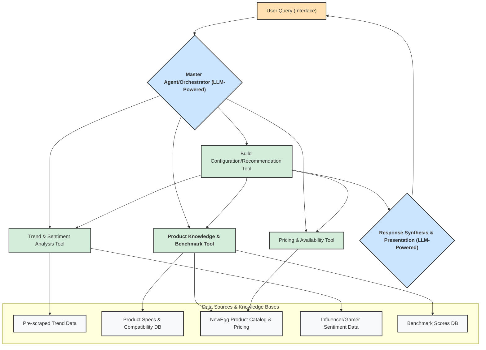
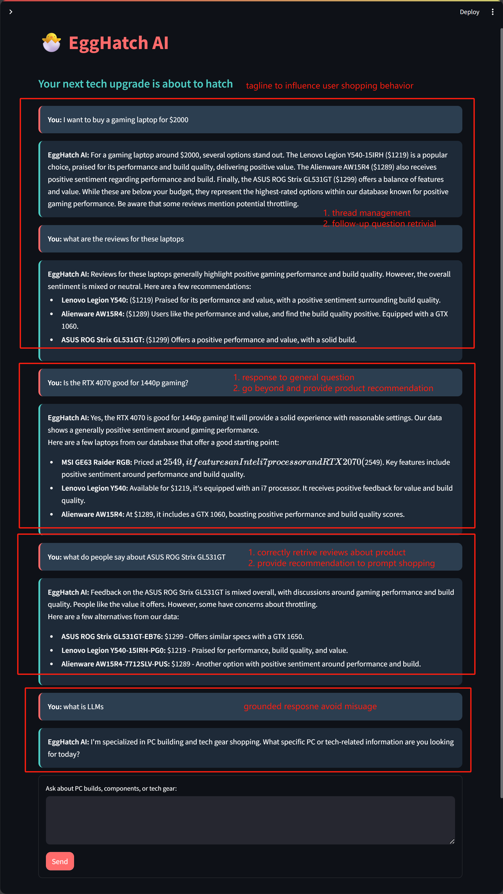
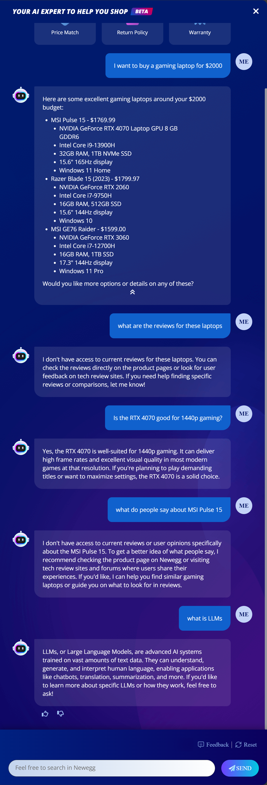

# 🐣 EggHatch: AI Agent for PC Building & Gear Shopping

> "Your next tech upgrade is about to hatch."

## Current NewEgg AI Application Gaps

Current AI tools on NewEgg, while helpful, present opportunities for enhancement:

- **AI Assistant**: 
    - Lack of efficient conversational context management causes responses to become irrelevant, inaccurate or hallucinatory. (e.g., the products information from follow up queries is not aligned with the inital recommendations, and the assistant may not be able to reiterate the product information corrctly like reviews etc)
    - The basis for its recommendations is not clear, potentially limiting the personalization and depth of advice (e.g., recommendation engine vs. simple keyword matching).
    - The response is not in streaming format(resposne appearing all at once vs streaming with word by word), which can be disorienting for users.

- **"PC Building with AI" Tool**: 
    - Primarily relies on structured inputs or keyword recognition, lacking nuanced natural language understanding for complex user requests regarding PC builds.

- **Segmented User Experience**: 
    - NewEgg has implemented an AI chatbot and a "PC building with AI" tool, but these often operate as separate entities accessed from different entry points. This can lead to a disjointed experience, lacking a unique and consistent AI identity that could foster a stronger connection and more seamless journey for customers.

This EggHatch AI Agent aims to address these gaps by providing a more conversational, context-aware, and deeply analytical AI agent.

## Core Idea

A user interacts with the "EggHatch AI Agent" using natural language (e.g., "I want to build a gaming PC with a $2000 budget," or "What's the best gaming laptop under $1500?"). The agent then orchestrates several specialized sub-agents or tools to fulfill the request, providing comprehensive recommendations including performance benchmarks.

## Improvements

### State Management for Conversational Context and natural language understanding for complex user requests
### Unified AI Avatar Identity for better user connection and streaming response for better user experience 
### Applied State-of-the-Art AI Models for diverse analysis and Recommendations with agentic framework to handel different tasks improving the quality of recommendations and user experience

## High-Level Agent Architecture & Workflow



## Detailed Components & Workflow

### 1. Master Agent / Orchestrator

#### Input
- User's natural language query

#### Tasks
- Uses an LLM to understand user intent, budget, preferences, and needs
- Decomposes the query into sub-tasks for specialized agents/tools
- Manages information flow between sub-agents and maintains conversational state

#### Example
For "I need a gaming laptop around $1800 that's good for competitive FPS titles and has a decent Time Spy score," it identifies tasks like:
- Determine current popular gaming laptop models in this price range
- Check key features (refresh rate, GPU, CPU)
- Find reported Time Spy scores for these models
- Get current prices and availability
- Consider current trends and reviews

#### Tech Stack

##### POC Level
- **Orchestration**: Python with LangGraph (a framework for building stateful, multi-step AI workflows with directed graphs that manages state transitions and conditional routing)
- **LLM Integration**: Python requests library or dedicated client for locally hosted LLM via Ollama API
- **State Management**: In-memory within LangGraph states or simple Python dictionaries
- **Prompt Engineering**: Manually crafted prompts stored as strings or in configuration files

##### Production Level
- **Orchestration**: LangGraph deployed as part of a scalable service (e.g., on Kubernetes)
- **Concurrency & Async**: Message queuing system (e.g., Kafka)
- **LLM Integration**: Robust API clients with retry logic and error handling
- **State Management**: Distributed cache (Redis) and NoSQL database (MongoDB)
- **Prompt Management**: Version-controlled prompt templates
- **Monitoring**: Comprehensive logging and metrics

### 2. Specialized Sub-Agents / Tools

#### 2a. Trend & Sentiment Analysis Agent/Tool

##### Tasks
- Accesses/analyzes data on product trends, market sentiment, and influencer opinions
- Data Sources: Scraped CSVs/databases, outputs from NLP pipelines
- Output: Insights on popularity, regard, or issues

##### Tech Stack

###### POC Level:

- **Initial Data Collection**: Python with Crawl4AI to scrape relevant web data (news, forums, reviews) and save it into local CSV files.
- **Data Access**: Python with Pandas to read from these local CSV files.

- **State-of-the-Art AI Models Implemented**:
  - **Topic Modeling**: Scikit-learn's LatentDirichletAllocation (LDA) trained on-the-fly
  - **Sentiment Analysis**: DistilBERT ("distilbert-base-uncased-finetuned-sst-2-english") for inference only
  - **Zero-shot Classification**: DistilBART ("valhalla/distilbart-mnli-12-1") for feature categorization
  - **Semantic Similarity**: Sentence-Transformers ("all-MiniLM-L6-v2") for embedding generation
  - **LLM Integration**: Gemma 3 12B via Ollama for orchestration and response synthesis

- **Note**: Neural network model training is explicitly omitted for the POC level. Only inference using existing pre-trained models is implemented for deep learning components. Lightweight statistical methods (like LDA for topic modeling) are still trained on-the-fly as they require minimal computational resources.

###### Production Level:

- **Data Ingestion**: Automated scraping pipelines (e.g., Crawl4AI, Scrapy) managed by an orchestrator like Airflow.
- **Data Storage**: Data lake (e.g., AWS S3, Google Cloud Storage) for raw data; structured results in a data warehouse (e.g., Snowflake) or a document database.
- **NLP Pipeline**: Robust NLP pipelines (potentially using Apache Spark for large-scale processing) for topic modeling, sentiment analysis (possibly fine-tuning domain-specific Transformer models), and NER.
- **Feature Store Integration**: Results (trend scores, sentiment distributions) could be published to a Feature Store.
- **Monitoring**: Data quality checks, drift detection for NLP model inputs/outputs.

#### 2b. Product Knowledge, Compatibility & Benchmark Agent/Tool

##### Tasks
- Accesses knowledge of PC components/laptops, specs, compatibility, and benchmarks
- Data Sources: Curated databases, benchmark aggregation sites
- Output: Compatible component lists, product details, benchmark data

##### Tech Stack

###### POC Level
- **It is not implemented in the POC due to time constraints.**

###### Production Level
- **Knowledge Base**: Robust relational database (e.g., PostgreSQL, MySQL) for structured product specs and complex compatibility rules (for PC components) or detailed configurations (for laptops). A graph database (e.g., Neo4j) could be very effective for modeling relationships.
- **Benchmark Data**: Dedicated table/collection within the database, regularly updated via scraping or API feeds from benchmark sites.
- **Data Ingestion**: Automated pipelines to update product specs, compatibility rules, and benchmarks.
- **Querying**: SQL/Cypher/ORM
- **Estimation**: Simple ML models (scikit-learn) to estimate benchmark scores for unlisted configurations.

#### 2c. Pricing & Availability Agent/Tool

##### Tasks
- Fetches pricing/availability from NewEgg
- Simulates "good deal" assessment
- Data Sources: NewEgg product pages/API, historical pricing data
- Output: Price, stock status, deal assessment

##### Tech Stack

###### POC Level
- **It is not implemented in the POC due to time constraints.**

###### Production Level
- **Data Source**: NewEgg's catalog
- **Deal Assessment**: 
  - Time-series forecasting models (Prophet) for price predictions.
  - Anomaly detection algorithms (scikit-learn) to flag unusually good deals.
  - Potentially use an LLM to prompt with historical context and current price for a qualitative deal assessment.
- **Caching**: Cache frequently accessed product prices (e.g., using Redis).

#### 2d. Build Configuration / Recommendation Agent/Tool

##### Tasks
- Assembles recommended PC builds or laptop suggestions
- Optimizes for budget, performance, and trends
- Output: Build lists/recommendations with justifications

##### Tech Stack

###### POC Level
- **It is not implemented in the POC due to time constraints.**

###### Production Level
- **Logic**: 
  - Supervised ML models (scikit-learn, XGBoost, LightGBM) trained on historical "good builds" or popular laptop configurations if such data exists.
  - LLM-driven reasoning: Prompting a powerful LLM with all constraints, available components/laptops, prices, and trend data to generate and justify a build/recommendation.
  - Reinforcement Learning: Train an agent in a simulated environment to learn optimal build configuration or laptop selection strategies.
- **Personalization**: User profile integration
- **A/B Testing**: Framework for strategy comparison

### 3. Response Synthesis & Presentation

#### Tasks
- Gathers sub-agent outputs
- Synthesizes user-friendly response
- Output: Clear, actionable recommendation with performance context

#### Tech Stack

##### POC Level
- **LLM Integration**: Python requests or client library
- **Prompt Engineering**: Manually crafted prompts

##### Production Level
- **LLM Integration**: Robust API clients
- **Prompt Engineering**: Advanced prompt chaining
- **Content Moderation**: Output safety checks
- **Caching**: Response caching

## User Interface

### POC Level
- Streamlit (Python)

### Production Level
- Scalable web application (React/Vue.js/Angular frontend)
- FastAPI backend

## Project Structure

```
EggHatch-AI/
├── data/                     # Data files
│   ├── csv/                  # Aggregated CSV data
│   ├── products/             # Individual product data
│   └── reviews/              # Product reviews
├── notebooks/                # Jupyter notebooks for data exploration
├── app/                      # Core application logic
│   ├── __init__.py
│   ├── master_agent.py       # Main LangGraph orchestration
│   ├── agents/               # Specialized sub-agent modules
│   │   ├── __init__.py
│   │   ├── data_pipeline.py  # Data loading and preprocessing
│   │   ├── trend_analysis.py # Topic modeling and feature identification
│   │   ├── sentiment_analysis.py # Sentiment classification
│   │   ├── product_knowledge.py  # Product information retrieval
│   │   ├── pricing_availability.py # Pricing data
│   │   └── build_recommendation.py # Build suggestions
│   ├── llm_integrations.py   # Ollama API client for Gemma 3 12B
│   └── prompts.py            # LLM prompt templates
├── dashboard_app.py          # Streamlit UI
├── Dockerfile               # Docker image definition
├── requirements.txt         # Python dependencies
├── .env.example            # Environment variables template
├── .env                    # Environment variables (gitignored)
├── .gitignore             # Git exclusions
└── README.md              # Project documentation
```

## Setup Instructions

1. Clone the repository
2. Copy `.env.example` to `.env` and configure your environment variables
3. Build and run the Docker container:
   ```bash
   docker build -t egghatch-ai .
   docker run --env-file .env egghatch-ai
   ```
4. Access the Streamlit dashboard run `streamlit run dashboard_app.py`

## Improvements Comparison

Below is a comparison between EggHatch AI and the current NewEgg AI assistant, highlighting the key improvements in multi-turn conversation handling, context preservation, and response quality:

| EggHatch AI (Our Solution) | Current NewEgg AI Assistant |
|:-------------------------:|:-------------------------:|
|  |  |
| **Key Improvements:** <br>1. Thread management for context preservation<br>2. Follow-up question handling<br>3. Specific product recommendations with actual prices<br>4. Coherent responses to vague queries<br>5. Streaming response format | **Current Limitations:** <br>1. No access to current reviews<br>2. Inability to maintain conversation context<br>3. Generic responses to follow-up questions<br>4. Limited product-specific information<br>5. Non-streaming response format |

The EggHatch AI system leverages LangGraph's thread management capabilities and enhanced state persistence to maintain context across multiple conversation turns, enabling more natural and informative interactions about specific products.