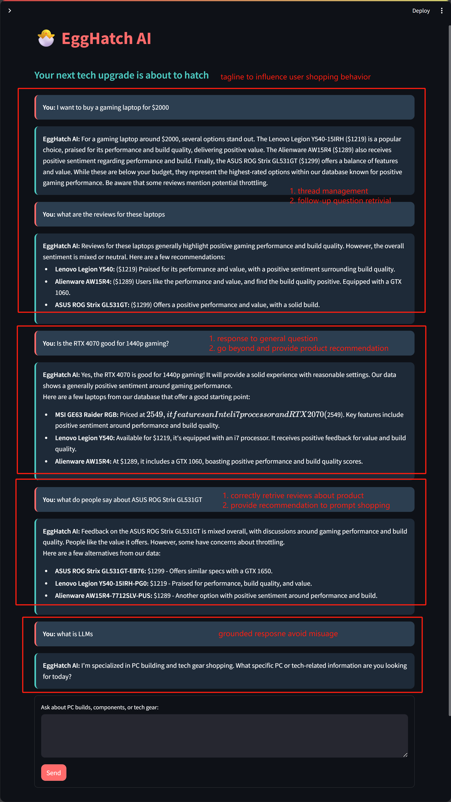
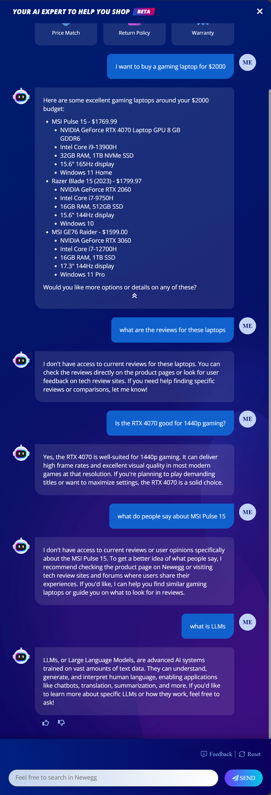
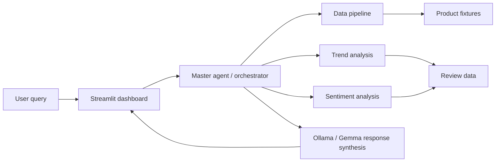

# EggHatch-AI

[](https://www.python.org/)
[](LICENSE)
[](https://austinz21.github.io/EggHatch-AI/)

EggHatch-AI is an open-source AI shopping agent prototype for PC building and gaming laptop recommendations. It combines conversational intent understanding, review analysis, sentiment signals, topic modeling, and a lightweight Streamlit interface into one agentic recommendation workflow.

This is a proof-of-concept project, not a production shopping engine. The goal is to show how an AI shopping assistant can preserve conversational context, analyze product reviews, and route a user request through specialized analysis tools before synthesizing a recommendation.

> EggHatch-AI is an independent research/demo project and is not affiliated with Newegg.

## Demo

| EggHatch-AI conversation | Baseline shopping assistant comparison |
| --- | --- |
|  |  |

## Why It Exists

Many shopping assistants answer product questions as one-off chat turns. EggHatch-AI explores a more structured pattern:

- keep conversational state across follow-up questions
- separate query understanding from product/review analysis
- use sentiment and topic signals to explain recommendation quality
- make the assistant feel like a coherent shopping guide instead of a keyword wrapper
- demonstrate how agentic decomposition can improve consumer decision workflows

## What It Does Today

- Orchestrates a user query through a LangGraph-style master agent flow
- Loads gaming laptop product and review data from local CSV/JSON fixtures
- Runs review cleaning, feature extraction, and basic product filtering
- Uses LDA topic modeling to surface review themes
- Uses DistilBERT sentiment analysis when available, with a rule-based fallback path
- Synthesizes a conversational response through a local Ollama model
- Provides a Streamlit dashboard for trying multi-turn shopping queries

## Architecture


```mermaid
flowchart LR
    User["User query"] --> UI["Streamlit dashboard"]
    UI --> Master["Master agent / orchestrator"]
    Master --> Data["Data pipeline"]
    Master --> Trend["Trend analysis"]
    Master --> Sentiment["Sentiment analysis"]
    Trend --> Reviews["Review data"]
    Sentiment --> Reviews
    Data --> Products["Product fixtures"]
    Master --> LLM["Ollama / Gemma response synthesis"]
    LLM --> UI
```

Current POC scope:

- Implemented: dashboard, master agent flow, data pipeline, sentiment analysis, trend/topic analysis, local LLM integration.
- Planned/stubbed: live product knowledge, live pricing/availability, benchmark ingestion, richer build compatibility logic.

## Quick Start

### 1. Clone

```bash
git clone https://github.com/AustinZ21/EggHatch-AI.git
cd EggHatch-AI
```

### 2. Configure environment

```bash
cp .env.example .env
```

Default `.env.example` assumes a local Ollama server:

```text
OLLAMA_BASE_URL=http://localhost:11434
OLLAMA_MODEL=gemma3:12b
```

### 3. Install runtime dependencies

```bash
python -m venv venv
venv\Scripts\activate
pip install -r requirements.txt
```

On macOS/Linux:

```bash
python -m venv venv
source venv/bin/activate
pip install -r requirements.txt
```

### 4. Start Ollama

Install Ollama from [ollama.com](https://ollama.com), then pull the configured model:

```bash
ollama pull gemma3:12b
```

### 5. Run the app

```bash
streamlit run dashboard_app.py
```

Open `http://localhost:8501`.

## Docker

```bash
docker build -t egghatch-ai .
docker run -p 8501:8501 --env-file .env egghatch-ai
```

## Example Queries

```text
I want to buy a gaming laptop under $2000.
What are the reviews saying about these laptops?
Which options are better for competitive FPS games?
What matters more here: cooling, display, or GPU?
```

## Project Structure

```text
EggHatch-AI/
  app/
    agents/
      data_pipeline.py          # Data loading, cleaning, and filters
      trend_analysis.py         # Topic modeling and feature signals
      sentiment_analysis.py     # Sentiment classifier with fallback
      product_knowledge.py      # Planned product/benchmark agent
      pricing_availability.py   # Planned pricing agent
      build_recommendation.py   # Planned build recommendation agent
    llm_integrations.py         # Ollama client wrapper
    master_agent.py             # Agent orchestration flow
    prompts.py                  # Prompt templates
  data/                         # Local product and review fixtures
  docs/                         # GitHub Pages project site
  images/                       # Demo screenshots
  tests/                        # Lightweight smoke tests
  dashboard_app.py              # Streamlit UI
  Dockerfile
  requirements.txt
```

## Documentation

- Project site: [austinz21.github.io/EggHatch-AI](https://austinz21.github.io/EggHatch-AI/)
- Generated code walkthrough: [EggHatch-AI Tutorial](https://austinz21.github.io/EggHatch-AI-Tutorial/)
- Roadmap: [ROADMAP.md](ROADMAP.md)
- Contributing guide: [CONTRIBUTING.md](CONTRIBUTING.md)

## Limitations

EggHatch-AI is intentionally scoped as a local prototype:

- product and review data are static fixtures
- live pricing and availability are not implemented
- PC compatibility and benchmark agents are planned but not implemented
- recommendation quality depends on local data coverage
- large NLP models may require significant memory and first-run download time
- the current Streamlit UI is a demo interface, not a production storefront

## Star History

<a href="https://www.star-history.com/?type=date&repos=AustinZ21%2FEggHatch-AI">
  <picture>
    <source media="(prefers-color-scheme: dark)" srcset="https://api.star-history.com/chart?repos=AustinZ21/EggHatch-AI&type=date&theme=dark&legend=top-left" />
    <source media="(prefers-color-scheme: light)" srcset="https://api.star-history.com/chart?repos=AustinZ21/EggHatch-AI&type=date&legend=top-left" />
    
  </picture>
</a>

## Contributing

Issues and pull requests are welcome. Good first contribution areas:

- improve product/review fixtures
- add lightweight evaluation cases
- expand recommendation explanations
- implement live pricing or benchmark adapters
- improve Streamlit interaction polish

Please read [CONTRIBUTING.md](CONTRIBUTING.md) and [CODE_OF_CONDUCT.md](CODE_OF_CONDUCT.md) before contributing.

## License

MIT License. See [LICENSE](LICENSE).
